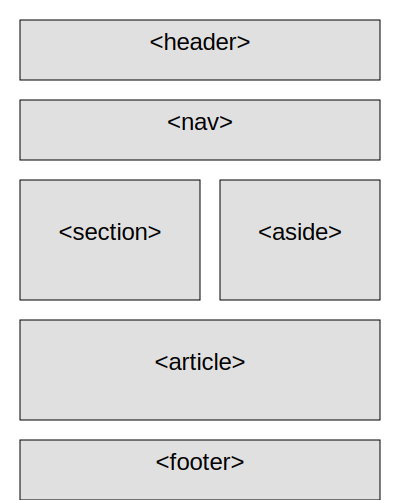

## HTML

- [HTML](#html)
- [Definición de HTML](#definición-de-html)
- [Estructura base de un documento HTML](#estructura-base-de-un-documento-html)
- [Generar estructura de HTML en VS Code](#generar-estructura-de-html-en-vs-code)
- [Estructura de Assets](#estructura-de-assets)
- [Etiqueta HEAD](#etiqueta-head)
- [Etiqueta BODY](#etiqueta-body)
- [Etiqueta `<p>` (Párrafo):](#etiqueta-p-párrafo)
- [Etiquetas `<h1>`, `<h2>`, `<h3>`, etc. (Encabezados):](#etiquetas-h1-h2-h3-etc-encabezados)
- [Etiqueta `` (Imagen):](#etiqueta-img-imagen)
- [Etiqueta `<a>` (Enlace):](#etiqueta-a-enlace)
- [Etiqueta `<ul>` y `<ol>` (Listas):](#etiqueta-ul-y-ol-listas)
- [Imagen con enlace (`<a>` con ``)](#imagen-con-enlace-a-con-img)
- [Menu de navegación `<nav>` con `<ul>`, `<li>`, y `<a>`](#menu-de-navegación-nav-con-ul-li-y-a)
- [Etiqueta `<div>` (División o contenedor):](#etiqueta-div-división-o-contenedor)
- [Etiquetas semánticas en HTML5:](#etiquetas-semánticas-en-html5)
- [Serie de preguntas para seleccionar etiquetas semánticas:](#serie-de-preguntas-para-seleccionar-etiquetas-semánticas)
- [Etiqueta `<header>` (Encabezado):](#etiqueta-header-encabezado)
- [Etiqueta `<nav>` (Navegación):](#etiqueta-nav-navegación)
- [Etiqueta `<section>` (Sección):](#etiqueta-section-sección)
- [Etiqueta `<article>` (Artículo):](#etiqueta-article-artículo)
- [Etiqueta `<aside>` (Barra lateral o contenido adicional):](#etiqueta-aside-barra-lateral-o-contenido-adicional)
- [Etiqueta `<footer>` (Pie de página):](#etiqueta-footer-pie-de-página)
- [Etiqueta `<main>` (Contenido principal):](#etiqueta-main-contenido-principal)
- [Etiqueta `<figure>` y `<figcaption>` (Figura y leyenda):](#etiqueta-figure-y-figcaption-figura-y-leyenda)
- [Hero Section](#hero-section)
- [Integración de Google Fonts en una Página Web](#integración-de-google-fonts-en-una-página-web)
- [Insertar Icono Font Awesome y Personalización](#insertar-icono-font-awesome-y-personalización)
- [Insertar SVG y Personalización](#insertar-svg-y-personalización)

---

## Definición de HTML
HTML (HyperText Markup Language) es el lenguaje de marcado estándar utilizado
para crear y estructurar el contenido en la web. Define la estructura básica de
una página web mediante etiquetas, permitiendo la inclusión de texto, imágenes,
enlaces, formularios y otros elementos multimedia. HTML es la base sobre la que
se construyen todas las páginas web, y trabaja en conjunto con CSS y JavaScript
para crear experiencias web interactivas y visualmente atractivas.

---

## Estructura base de un documento HTML
La estructura base de un documento HTML sigue una estructura jerárquica simple,
que define el esqueleto básico necesario para cualquier página web. 

```html
<!DOCTYPE html>
<html lang="es">
<head>
    <meta charset="UTF-8">
    <meta name="viewport" content="width=device-width, initial-scale=1.0">
    <title>Título de la Página</title>
</head>
<body>
    <!-- Contenido de la página -->
</body>
</html>
```
### Desglose de la estructura:
* **`<!DOCTYPE html>`**: Declara el tipo de documento y asegura la compatibilidad
  con HTML5.
* **`<html lang="es">`**: La etiqueta raíz que contiene todo el contenido del
  documento; **`lang="es"`** define el idioma del contenido.
* **`<head>`**: Contiene metadatos sobre el documento, como el conjunto de
  caracteres (**`<meta charset="UTF-8">`**), el título de la página (**`<title>`**),
  y otras configuraciones como la etiqueta de viewport para la compatibilidad
  con dispositivos móviles.
* **`<body>`**: Contiene todo el contenido visible de la página web, como texto,
  imágenes, enlaces, y más. 


---

## Generar estructura de HTML en VS Code
Para crear una estructura básica de HTML automáticamente en Visual Studio Code,
sigue estos pasos:
1. **Crear un nuevo archivo HTML:**
   - Abre Visual Studio Code.
   - Crea un nuevo archivo con la extensión .html.
2. **Utilizar Emmet para generar la estructura:**
   - Dentro del archivo HTML, escribe `!` (signo de exclamación).
   - Presiona **`Enter`** o **`Tab`**.
3. **Resultado:**
   - Esto generará automáticamente la estructura básica de un documento HTML5.

**Nota:**
Esta funcionalidad es proporcionada por **Emmet**, que está integrado en Visual 
Studio Code y permite acelerar la escritura de código HTML y CSS.

Código generado:
```html
<!DOCTYPE html>
<html lang="en">
<head>
	<meta charset="UTF-8">
	<meta name="viewport" content="width=device-width, initial-scale=1.0">
	<title>Document</title>
</head>
<body>
	
</body>
</html>
```

---

## Estructura de Assets
En el desarrollo web de una página estática basada en assets, la estructura de
directorios suele seguir un patrón organizado para facilitar el mantenimiento, 
escalabilidad y claridad del proyecto.

A continuación se presenta una estructura de carpetas recomendada:

```plaintext
/
├── index.html            # Archivo HTML principal
├── assets/               # Directorio principal para todos los assets
│   ├── css/              # Archivos CSS
│   │   └── styles.css    # Hoja de estilos principal
│   ├── js/               # Archivos JavaScript
│   │   └── main.js       # Script principal
│   ├── images/           # Imágenes utilizadas en la página
│   │   └── logo.png      # Ejemplo de imagen
│   ├── fonts/            # Fuentes personalizadas
│   │   └── custom-font
```

---

## Etiqueta HEAD
### Definición:
La etiqueta **`<head>`** en HTML es una sección del documento que contiene metadatos
y otros elementos que no son visibles directamente en la página web, pero que
son esenciales para la configuración, el rendimiento y la optimización de la 
página.

### Función:
* **Metadatos:** La etiqueta **`<head>`** alberga metadatos sobre la página, como
  el título, la codificación de caracteres, enlaces a archivos CSS, scripts, y
  meta-etiquetas para SEO.
* **Referencias externas:** Incluye enlaces a hojas de estilo, fuentes, y scripts
  externos.
* **Optimización:** Facilita la optimización para motores de búsqueda y redes
  sociales mediante meta-etiquetas.

### Características:
* **No visible:** El contenido dentro de **`<head>`** no se muestra en la página,
  pero es crucial para el correcto funcionamiento y visualización de la misma.
* **Posicionamiento:** Debe estar presente antes de la etiqueta **`<body>`**.
* **Contenido típico:** Título de la página (**`<title>`**), enlaces a hojas de estilo
* (**`<link>`**), scripts (**`<script>`**), metaetiquetas (**`<meta>`**), entre otros.

### Ejemplo en código:
```html
<!DOCTYPE html>
<html lang="es">
<head>
    <meta charset="UTF-8">
    <meta name="viewport" content="width=device-width, initial-scale=1.0">
    <meta name="description" content="Descripción de la página para SEO">
    <title>Mi Página Web</title>
    <link rel="stylesheet" href="assets/css/styles.css">
    <link rel="icon" href="assets/images/favicon.ico">
    <script src="assets/js/main.js" defer></script>
</head>
<body>
    <!-- Contenido de la página -->
</body>
</html>

```
### Otros datos importantes:
* **SEO y redes sociales:** Metaetiquetas como **`<meta name="description">`** y Open Graph
  (**`<meta property="og:title">`**) mejoran la visibilidad de la página en motores
  de búsqueda y redes sociales.
* **Compatibilidad y rendimiento:** Incluir meta viewport para la adaptación en dispositivos
  móviles y usar el atributo **`defer`** en **`<script>`** para cargar scripts sin 
  bloquear el renderizado.

---

## Etiqueta BODY
### Definición:
La etiqueta **`<body>`** en HTML es la sección del documento que contiene todo el
contenido visible de la página web, incluyendo texto, imágenes, enlaces,
formularios, y cualquier otro elemento que el usuario puede ver e interactuar.

### Función:
* **Contenedor del contenido:** La etiqueta **`<body>`** alberga todo el contenido visual
  y los elementos interactivos que se muestran en el navegador.
* **Interacción**: Es la parte de la página que los usuarios ven y con la que pueden
  interactuar.

### Características:
* **Visible:** Todo lo que se coloca dentro de **`<body>`** se renderiza en la página web.
* **Única por documento:** Solo puede haber una etiqueta **`<body>`** por documento HTML.
* **Carga del contenido:** El contenido dentro de **`<body>`** se carga después de que el
  navegador procesa las etiquetas y metadatos en **`<head>`**.

### Ejemplo en código:
```html
<!DOCTYPE html>
<html lang="es">
<head>
    <meta charset="UTF-8">
    <meta name="viewport" content="width=device-width, initial-scale=1.0">
    <title>Mi Página Web</title>
</head>
<body>
    <h1>Bienvenido a mi página web</h1>
    <p>Este es un párrafo de ejemplo dentro del cuerpo de la página.</p>
</body>
</html>
```
### Otros datos importantes:
* **Scripts y estilos:** Aunque es posible incluir scripts y estilos dentro de 
  **`<body>`**, generalmente se recomienda mantenerlos en el **`<head>`** o en archivos
  externos para una mejor organización y rendimiento.
* **Eventos de carga:** El contenido dentro de **`<body>`** se carga después de los
  elementos en **`<head>`**, y se pueden utilizar eventos como **`onload`** para ejecutar
  scripts una vez que el cuerpo de la página esté completamente cargado.

---
## Etiqueta `<p>` (Párrafo):
* **Estructura: `<p>Texto del párrafo</p>`**
* **Ejemplo:**
```html
<p>Este es un párrafo de texto.</p>
```
* **Dato extra:** Los párrafos añaden un margen por defecto antes y después del 
contenido.

---
## Etiquetas `<h1>`, `<h2>`, `<h3>`, etc. (Encabezados):
* **Estructura: `<h1>Texto del encabezado</h1>`, `<h2>Texto del encabezado</h2>`, ...,**
  **`<h6>Texto del encabezado</h6>`**
* **Ejemplo:**
```html
<h1>Encabezado principal</h1>
<h2>Subtítulo o sección</h2>
<h3>Subsección</h3>
```
- **Dato extra**: Los encabezados **`<h1>`** a **`<h6>`** representan niveles jerárquicos de
importancia, siendo **`<h1>`** el más importante (usualmente el título principal de la
página) y **`<h6>`** el menos importante. Estos encabezados también juegan un papel
crucial en la accesibilidad y el SEO, ayudando a estructurar el contenido de
manera lógica.

---
## Etiqueta `` (Imagen):
- **Estructura: ``**
- **Ejemplo:**
```html

```
- **Dato extra**: El atributo alt es importante para la accesibilidad y para SEO.

---
## Etiqueta `<a>` (Enlace):
- **Estructura: `<a href="URL">Texto del enlace</a>`**
- **Ejemplo:**
```html
<a href="https://example.com">Visita nuestro sitio</a>
```
- **Dato extra:** El atributo **`target="_blank"`** se puede usar para abrir el enlace en
una nueva pestaña.

### Vinculación de Elementos con `id`

Para enlazar un elemento específico dentro de una página web, la forma más 
efectiva es asignarle un id único y luego crear un enlace hacia ese id.

**Pasos para Vincular**
1. **Asignar un `id` al elemento destino:**
```html
<h2 id="seccion1">Sección 1</h2>
```
Esto identifica el elemento como un objetivo de enlace.

2. **Crear un enlace al `id`:**
```html
<a href="#seccion1">Ir a Sección 1</a>
```
El `href` con `#` seguido del `id` enlaza directamente al elemento con ese `id`.

**Resultado**
Al hacer clic en el enlace, la página se desplazará automáticamente hacia el 
elemento con el `id` correspondiente. Esto es útil para crear menús de 
navegación que lleven a diferentes secciones de la misma página.

Este método es estándar y garantiza que el enlace sea preciso y funcional.

---

## Etiqueta `<ul>` y `<ol>` (Listas):
- **Estructura**: 
  - **Listas no ordenadas: `<ul><li>Elemento 1</li><li>Elemento 2</li></ul>`**
  - **Listas ordenadas: `<ol><li>Elemento 1</li><li>Elemento 2</li></ol>`**
- **Ejemplo**:
```html
<ul>
  <li>Elemento no ordenado 1</li>
  <li>Elemento no ordenado 2</li>
</ul>

<ol>
  <li>Elemento ordenado 1</li>
  <li>Elemento ordenado 2</li>
</ol>
```
- **Dato extra:** Las listas **`<ul>`** se utilizan para elementos sin un orden específico,
mientras que las listas **`<ol>`** son para elementos que tienen un orden o secuencia.
Se pueden anidar listas dentro de listas para crear estructuras más complejas.

---
## Imagen con enlace (`<a>` con ``)
- **Estructura:**
```html
<a href="URL">
  
</a>
```
- **Ejemplo:**
```html
<a href="https://example.com">
  
</a>
```
- **Dato extra**: Esta combinación permite que una imagen funcione como un enlace. Es
útil para crear botones visuales o enlaces gráficos en una página web. Asegúrate
de incluir un buen alt en la imagen para accesibilidad y SEO.

---

## Menu de navegación `<nav>` con `<ul>`, `<li>`, y `<a>`
- **Ejemplo:**
```html
<nav>
  <ul>
    <li><a href="inicio.html">Inicio</a></li>
    <li><a href="sobre.html">Sobre Nosotros</a></li>
    <li><a href="contacto.html">Contacto</a></li>
  </ul>
</nav>
```
- **Dato extra**: El elemento **`<nav>`** se usa para envolver el bloque de navegación, 
mejorando la semántica y accesibilidad del HTML. Dentro, **`<ul>`** crea una lista no
ordenada de enlaces, y cada enlace está contenido en un **`<li>`** (elemento de lista).
Esto es una práctica común para estructurar menús de navegación en sitios web.

---
## Etiqueta `<div>` (División o contenedor):
* **Estructura: `<div>Contenido aquí</div>`**
* **Ejemplo:**
```html
<div class="contenedor">
    <h2>Título de la sección</h2>
    <p>Este es un párrafo dentro de un contenedor div.</p>
</div>
```
* **Dato extra**: La etiqueta **`<div>`** es un contenedor genérico que se usa para 
  agrupar elementos y aplicarles estilos o scripts. No tiene un significado 
  semántico propio, por lo que es ideal para organizar el layout de una página 
  sin añadir ninguna semántica adicional. Es muy común en el diseño web, 
  especialmente en combinación con CSS y JavaScript.

---
## Etiquetas semánticas en HTML5:
Las etiquetas semánticas en HTML5 son aquellas que describen claramente su 
propósito y el tipo de contenido que contienen, mejorando la accesibilidad, SEO, 
y la comprensión del código tanto para los desarrolladores como para los 
navegadores.

### Principales etiquetas semánticas:
- **`<header>`**: Define un encabezado para un documento o sección.
- **`<nav>`**: Indica un conjunto de enlaces de navegación.
- **`<section>`**: Representa una sección genérica de un documento, generalmente con un 
  encabezado.
- **`<article>`**: Denota un contenido independiente y autocontenido, como un artículo 
  de blog o una noticia.
- **`<aside>`**: Contiene contenido relacionado indirectamente con el contenido principal, 
  como una barra lateral o un bloque de anuncios.
- **`<footer>`**: Define el pie de página para un documento o sección.
- **`<main>`**: Representa el contenido principal del documento, excluyendo cabeceras, 
  barras laterales, y pie de página.
- **`<figure>`** y **`<figcaption>`**: Usado para agrupar contenido como imágenes, gráficos, 
  o tablas con una leyenda.

### Ventajas de usar etiquetas semánticas:
- **Accesibilidad**: Mejora la accesibilidad, permitiendo que los lectores de pantalla 
  interpreten mejor la estructura del documento.
- **SEO**: Los motores de búsqueda pueden entender mejor la estructura y relevancia 
  del contenido, mejorando el posicionamiento.
- **Mantenimiento**: Facilita la lectura y mantenimiento del código al proporcionar 
  una estructura más clara y significativa.

### Ejemplo:
```html
<article>
    <header>
        <h1>Título del Artículo</h1>
        <p>Fecha: 15 de agosto de 2024</p>
    </header>
    <section>
        <p>Contenido principal del artículo...</p>
    </section>
    <footer>
        <p>Autor: John Doe</p>
    </footer>
</article>
```

Las etiquetas semánticas son una parte esencial de las mejores prácticas en HTML5, 
contribuyendo a la creación de documentos web más claros, accesibles y bien 
estructurados.

### Diagrama


---

## Serie de preguntas para seleccionar etiquetas semánticas:

### 1. ¿Es este contenido la cabecera o el título de una sección o del documento completo?
 * Si **sí**, usa **`<header>`**.

### 2. ¿Es este contenido un bloque independiente con sentido completo por sí mismo, como un artículo, una entrada de blog o una publicación de noticias?
* Si **sí**, usa **`<article>`**.

### 3. ¿Es este contenido una agrupación lógica de temas relacionados dentro de una página, como una sección de un informe o un capítulo de un libro?
* Si **sí**, usa **`<section>`**.

### 4. ¿Es este contenido un conjunto de enlaces de navegación?
* Si **sí**, usa **`<nav>`**.

### 5. ¿Es este contenido un bloque de información relacionado pero no esencial para el contenido principal, como una barra lateral, un bloque de anuncios o un widget?
* Si **sí**, usa **`<aside>`**.

### 6. ¿Es este contenido el pie de página de una sección o del documento completo, conteniendo información como derechos de autor, enlaces a términos de uso, o un contacto?
* Si **sí**, usa **`<footer>`**.

### 7. ¿Este contenido es la parte principal de la página, excluyendo encabezados, barras laterales y pies de página?
* Si **sí**, usa **`<main>`**.

---

## Etiqueta `<header>` (Encabezado):
* **Estructura: `<header>Contenido del encabezado</header>`**
* **Ejemplo:**
```html
<header>
    <h1>Bienvenido a Mi Sitio Web</h1>
    <nav>
        <ul>
            <li><a href="#inicio">Inicio</a></li>
            <li><a href="#sobre">Sobre Nosotros</a></li>
        </ul>
    </nav>
</header>
```
* **Dato extra**: Se usa para definir la cabecera de un documento o sección, 
  incluyendo títulos, logotipos, y menús de navegación.

---
## Etiqueta `<nav>` (Navegación):
* **Estructura: `<nav>Enlaces de navegación</nav>`**
* **Ejemplo:**
```html
<nav>
    <ul>
        <li><a href="#inicio">Inicio</a></li>
        <li><a href="#articulos">Artículos</a></li>
        <li><a href="#contacto">Contacto</a></li>
    </ul>
</nav>
```
* **Dato extra**: Se utiliza para agrupar enlaces de navegación principales de un 
  sitio o aplicación web.

---
## Etiqueta `<section>` (Sección):
* **Estructura: `<section>Contenido de la sección</section>`**
* **Ejemplo:**
```html
<section>
    <h2>Nuestra Historia</h2>
    <p>Somos una empresa dedicada a...</p>
</section>
```
 * **Dato extra**: Representa una sección genérica dentro de un documento, 
   típicamente acompañada de un encabezado.

---
## Etiqueta `<article>` (Artículo):
* **Estructura: `<article>Contenido del artículo</article>`**
* **Ejemplo:**
```html
Copiar código
<article>
    <h2>Título del Artículo</h2>
    <p>Este es el contenido de un artículo independiente...</p>
</article>
```
* **Dato extra**: Utilizado para contenido independiente y autocontenido que puede 
  ser distribuido o reutilizado, como artículos de noticias o publicaciones de 
  blog.

---
## Etiqueta `<aside>` (Barra lateral o contenido adicional):
* **Estructura: `<aside>Contenido relacionado</aside>`**
* **Ejemplo:**
```html
<aside>
    <h3>Enlaces Relacionados</h3>
    <ul>
        <li><a href="#tema1">Tema 1</a></li>
        <li><a href="#tema2">Tema 2</a></li>
    </ul>
</aside>
```
* **Dato extra**: Se usa para contenido que está relacionado indirectamente con el 
  contenido principal, como barras laterales o bloques de anuncios.

---
## Etiqueta `<footer>` (Pie de página):
* **Estructura: `<footer>Contenido del pie de página</footer>`**
* **Ejemplo:**
```html
<footer>
    <p>&copy; 2024 Mi Sitio Web. Todos los derechos reservados.</p>
    <nav>
        <ul>
            <li><a href="#politica">Política de Privacidad</a></li>
            <li><a href="#terminos">Términos de Uso</a></li>
        </ul>
    </nav>
</footer>
```
* **Dato extra**: Define el pie de página para un documento o sección, a menudo 
  contiene información sobre derechos de autor, enlaces legales, o información de
  contacto.

---
## Etiqueta `<main>` (Contenido principal):
* **Estructura: `<main>Contenido principal</main>`**
* **Ejemplo:**
```html
<main>
    <h2>Título Principal</h2>
    <p>Este es el contenido principal del documento...</p>
</main>
```
* **Dato extra**: Representa el contenido principal del documento, excluyendo 
  encabezados, barras laterales, y pies de página.

---
## Etiqueta `<figure>` y `<figcaption>` (Figura y leyenda):
* **Ejemplo:**
```html
<figure>
    
    <figcaption>Esta es una leyenda para la imagen.</figcaption>
</figure>
```
* **Dato extra**: **`<figure>`** se usa para agrupar contenido visual o ilustrativo, y 
  **`<figcaption>`** proporciona una leyenda o descripción para ese contenido.

---

## Hero Section
La **Hero Section** es una sección prominente y de gran tamaño que se coloca en la 
parte superior de una página web, especialmente en páginas de aterrizaje (landing
pages). Es la primera cosa que los visitantes ven al llegar a la página, y su 
objetivo es captar la atención del usuario, comunicar el valor principal de la 
oferta, y guiar al usuario hacia la acción deseada, como registrarse o hacer clic
en un enlace.

### Características principales:
* **Ubicación**: Situada en la parte superior de la página, ocupando un espacio 
  significativo en la pantalla.
* **Contenido**: Incluye un título destacado, subtítulo, una imagen o video llamativo,
  y un llamado a la acción (CTA), como un botón o enlace.
* **Diseño**: Estilo visualmente impactante, con una combinación de texto e imágenes 
  para captar la atención del usuario rápidamente.
* **Funcionalidad**: Dirigida a la conversión, orientando al usuario hacia la acción 
  deseada.

### Ejemplo:
**HTML:**
```html
<section class="hero">
    <div class="hero-content">
        <h1>Bienvenido a Nuestro Producto</h1>
        <p>Solución perfecta para tus necesidades</p>
        <a href="#registro" class="cta-button">Regístrate Ahora</a>
    </div>
    <div class="hero-image">
        
    </div>
</section>
```

**CSS:**
```css
/* Estilo para la Hero Section */
.hero {
    display: flex;
    justify-content: space-between;
    align-items: center;
    padding: 50px;
    background-color: #f5f5f5;
    background-image: url('background-image.jpg');
    background-size: cover;
    background-position: center;
    color: #333;
}

.hero-content {
    max-width: 50%;
}

.hero h1 {
    font-size: 48px;
    margin-bottom: 20px;
}

.hero p {
    font-size: 24px;
    margin-bottom: 30px;
}

.cta-button {
    display: inline-block;
    padding: 15px 30px;
    background-color: #007bff;
    color: #fff;
    text-decoration: none;
    font-size: 18px;
    border-radius: 5px;
    transition: background-color 0.3s ease;
}

.cta-button:hover {
    background-color: #0056b3;
}

.hero-image img {
    max-width: 100%;
    height: auto;
    border-radius: 10px;
}
```

### Dato extra:
* **Responsive Design**: Es crucial que la Hero Section sea responsive, es decir, 
  que se adapte bien a diferentes tamaños de pantalla, especialmente en 
  dispositivos móviles. Puedes lograr esto utilizando `@media queries` en el CSS.
* **Optimización SEO**: Debe incluir texto relevante y bien estructurado, ya que es 
  una de las primeras cosas que los motores de búsqueda leerán.

---
## Integración de Google Fonts en una Página Web
Google Fonts es un servicio gratuito que proporciona una amplia variedad de 
fuentes tipográficas que se pueden integrar fácilmente en una página web. A 
continuación te explico cómo integrar Google Fonts en tu proyecto web.

### Pasos para la Integración:
#### 1. Seleccionar una Fuente en Google Fonts:
  * Visita [Google Fonts](https://fonts.google.com/).
  * Explora las fuentes disponibles y selecciona la que deseas utilizar.
  * [Get font]
  * Una vez seleccionada, puedes personalizar los estilos (regular, bold, italic, 
    etc.) y los caracteres que necesitas.

#### 2. Obtener el Código de Integración:
  * [<> Get embed code]
  * Después de seleccionar la fuente y los estilos, Google Fonts generará un enlace 
  * **`<link>`** para incluir en el **`<head>`** de tu documento HTML.
  * Existe la opción de añadirla al CSS o al HTML. Google deja disponible 
    códigos para ambas opciones. **`<link>`** o **`@import`**
  * **Ejemplo**:
```html
<link rel="preconnect" href="https://fonts.googleapis.com">
<link rel="preconnect" href="https://fonts.gstatic.com" crossorigin>
<link href="https://fonts.googleapis.com/css2?family=Matemasie&display=swap" rel="stylesheet">
```
  * Este enlace carga la fuente directamente desde los servidores de Google.
  * **Ejemplo de la opción de incluirla en el CSS**:
```css
@import url('https://fonts.googleapis.com/css2?family=Matemasie&display=swap');
```

#### 3. Incluir el Enlace en el HTML:
  * Añade el enlace generado dentro de la etiqueta **`<head>`** de tu página HTML.
  * **Ejemplo**:
```html
<!DOCTYPE html>
<html lang="en">
<head>
    <meta charset="UTF-8">
    <meta name="viewport" content="width=device-width, initial-scale=1.0">
    <title>Mi Página Web</title>
    <link rel="preconnect" href="https://fonts.googleapis.com">
    <link rel="preconnect" href="https://fonts.gstatic.com" crossorigin>
    <link href="https://fonts.googleapis.com/css2?family=Matemasie&display=swap" rel="stylesheet">
</head>
<body>
    <!-- Contenido de la página -->
</body>
</html>
```

#### 4. Aplicar la Fuente en el CSS:
  * Una vez incluida la fuente en tu HTML, puedes aplicarla a cualquier elemento 
    de la página utilizando la propiedad **`font-family`** en tu archivo CSS.
  * **Ejemplo**:
```css
.matemasie-regular {
  font-family: "Matemasie", sans-serif;
  font-weight: 400;
  font-style: normal;
}
```

### Opciones Adicionales:
* **Optimización de Carga**:
  * La opción **`display=swap`** en el enlace permite mostrar texto en una fuente 
    genérica mientras la fuente personalizada se descarga, lo que mejora la 
    experiencia del usuario.
* **Fuentes Múltiples**:
  * Puedes agregar múltiples fuentes seleccionadas al mismo tiempo, simplemente 
    añadiéndolas al mismo enlace en Google Fonts.
  
---

## Insertar Icono Font Awesome y Personalización
Un **icono como fuente** es un glifo dentro de una fuente tipográfica, utilizado en 
lugar de caracteres textuales. **Font Awesome** es una popular biblioteca de iconos 
basada en fuentes que facilita la inserción de iconos escalables y 
personalizables en páginas web.

### Pasos para Insertar y Personalizar un Icono Font Awesome:
#### 1. Incluir Font Awesome:
* Inserta el siguiente enlace en el **`<head>`** de tu HTML para cargar Font Awesome 
  desde un CDN.
```html
<link rel="stylesheet" href="https://cdnjs.cloudflare.com/ajax/libs/font-awesome/5.15.3/css/all.min.css">
```

#### 2. Insertar un Icono:
* Usa la etiqueta **`<i>`** o **`<span>`** con la clase correspondiente al icono que deseas.
```html
<i class="fas fa-home"></i>
```

#### 3. Personalizar el Icono con CSS:
* **Tamaño**: Cambia el tamaño del icono usando **`font-size`**.
```css
i.fas {
    font-size: 24px;
}
```

* **Color**: Cambia el color del icono usando **`color`**.
```css
i.fas {
    color: blue;
}
```
* **Espaciado y Efectos**: Aplica márgenes, sombras, y otros estilos como lo harías 
  con texto.
```css
i.fas {
    margin-right: 10px;
    text-shadow: 2px 2px 4px #000000;
}
```

---
## Insertar SVG y Personalización
Un **SVG** (Scalable Vector Graphics) es un formato de imagen basado en XML que 
permite gráficos vectoriales escalables y totalmente personalizables en la web.

### Pasos para Insertar y Personalizar un SVG:
**1. Insertar un SVG en el HTML:**
* Puedes insertar un SVG directamente en el HTML como parte del documento.
```html
<svg width="100" height="100" xmlns="http://www.w3.org/2000/svg" class="mi-icono">
    <circle cx="50" cy="50" r="40" stroke="black" stroke-width="3" fill="red"/>
</svg>
```
**2. Personalizar el SVG con CSS:**
 * *Tamaño**: Puedes ajustar el tamaño del SVG usando **`width`** y **`height`**.
```css
.mi-icono {
    width: 150px;
    height: 150px;
}
```

* **Color**: Modifica el color de relleno (**`fill`**) o el color del borde (**`stroke`**) de 
  los elementos dentro del SVG.
```css
.mi-icono circle {
    fill: blue;
    stroke: green;
}
```
* **Otros Estilos**: Aplica sombras, bordes, y otros efectos como lo harías con otros 
  elementos HTML.
```css
.mi-icono {
    box-shadow: 2px 2px 4px rgba(0, 0, 0, 0.5);
}
```

---

